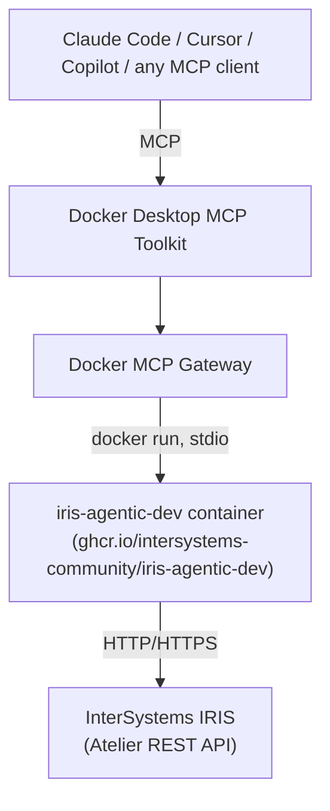

# iris-docker-mcp

Docker Desktop MCP Toolkit packaging for
[`iris-agentic-dev`](https://github.com/intersystems-community/iris-agentic-dev), the
InterSystems IRIS MCP server.

**This project does not implement an InterSystems IRIS MCP server. It packages and
integrates the `iris-agentic-dev` MCP server with Docker Desktop MCP Toolkit.**

## What this is NOT

- Not a reimplementation of any IRIS MCP tool. Every tool call is handled by upstream's
  own binary, unmodified.
- Not a fork of `iris-agentic-dev`. This repo contains no upstream source.
- Not an IRIS database image. You bring your own IRIS instance (native on Windows, in
  another container, or remote); this repo doesn't ship one.
- Not a security product. It documents and configures upstream's real gates; it does not
  add new ones. Read [docs/security.md](docs/security.md) before pointing this at
  anything other than a disposable dev namespace.

## Architecture



`server.yaml` and `config/` in this repo are the only things this project adds — a
catalog/profile definition and a few env-var/TOML presets. Everything below the
"container" box is upstream's.

## Prerequisites

- [Docker Desktop](https://www.docker.com/products/docker-desktop/) with the `docker mcp`
  CLI available (`docker mcp --help` should list subcommands).
- An InterSystems IRIS instance reachable from Docker Desktop, with the Atelier REST API
  enabled (the same requirement as the VS Code ObjectScript extension — no special setup
  needed beyond that).
- Windows users: see [docs/windows-setup.md](docs/windows-setup.md) for exact PowerShell
  commands, including a Docker MCP Toolkit walkthrough we ran end-to-end against a real
  Docker Desktop install.

## Quick start

```powershell
git clone <this-repo-url>
cd iris-docker-mcp
Copy-Item .env.example .env
notepad .env   # set IRIS_HOST, IRIS_WEB_PORT, IRIS_USERNAME, IRIS_PASSWORD, IRIS_NAMESPACE
.\scripts\test.ps1
```

If the smoke test passes, register it with Docker MCP Toolkit (Path A) or drop it
straight into your MCP client's config (Path B) — both are documented in
[docs/windows-setup.md](docs/windows-setup.md) and verified working end-to-end.

## Windows / `host.docker.internal` example

If IRIS runs natively on the same Windows machine as Docker Desktop:

```env
IRIS_HOST=host.docker.internal
IRIS_WEB_PORT=52773
IRIS_SCHEME=http
IRIS_NAMESPACE=USER
IRIS_USERNAME=_SYSTEM
IRIS_PASSWORD=your-password
```

`IRIS_WEB_PORT` is the IRIS **web gateway** port (Atelier REST API) — `52773` on
pre-2024.1 instances, `80` on 2024.1+ with IIS/Apache. It is **not** the superserver port
(1972); `iris-agentic-dev` never uses that port.

If IRIS runs in another container, use that container's name (same Docker network) or
`host.docker.internal` (only its port is published to the host). If IRIS is remote, set
`IRIS_HOST` to its hostname/IP.

## Configuration

All connection settings are environment variables — see [.env.example](.env.example) for
the full list with defaults and descriptions. `iris-agentic-dev` also supports a mounted
`.iris-agentic-dev.toml` for settings that have no env-var equivalent (category-based
policy gates, the `mcpTemplate` environment gate, audit emission) — see
[config/example-config.toml](config/example-config.toml) and
[docs/security.md](docs/security.md).

## ⚠️ Security warning

Read [docs/security.md](docs/security.md) before doing anything else with a real IRIS
instance. The short version, confirmed by testing against the actual image rather than
assumed from docs:

- **If you don't set `IRIS_WRITE_TOOLS_ENABLED` explicitly, it can default to enabled**
  — upstream infers it from your namespace name, and `USER` (IRIS's most common default
  namespace) infers to `true`. `.env.example` sets it to `0` explicitly; don't remove
  that unless you mean to.
- `IRIS_DESTRUCTIVE_TOOLS_ENABLED` does default to `false` and is never inferred — safer
  to leave alone, still set explicitly for clarity.
- Treat AI access to IRIS as privileged access, same as you would a human with the same
  credentials.

## Profiles

Four example profiles, built entirely from upstream's own gates — no tool list is
duplicated or hand-maintained here (see [docs/security.md](docs/security.md) for why):

| Profile | `config/profiles/*.toml` category allowlist | Write / destructive |
| --- | --- | --- |
| **IRIS Read Only** | `query`, `search`, `docs` | off / off |
| **IRIS Developer** | + `compile`, `execute`, `debug`, `source_control`, `skill` | on / off |
| **IRIS Operations** | `query`, `search`, `docs`, `admin` | off / off |
| **IRIS Full** | *(no allowlist — every category)* | your choice, opt in explicitly |

Categories are `iris-agentic-dev`'s own `[policy.default].allow` values, not something
this project invented. Pair a profile's TOML with the matching env vars — details and the
mount command are in [docs/security.md](docs/security.md#category-allowlist-policynameallow).

## Smoke test

```powershell
.\scripts\test.ps1
```

```bash
./scripts/test.sh
```

Checks, in order, failing clearly at the first problem:

1. Docker is installed and the daemon is running.
2. The image starts (`check_config` — never touches the network, so this only proves the
   binary runs) and warns if write-tool enablement was inferred rather than set.
3. The MCP tool catalog can be enumerated (`tool --list --json`).
4. IRIS is actually reachable and credentials work (`iris_namespace_list`).
5. A harmless read query succeeds (`iris_query` with `SELECT CURRENT_TIMESTAMP`).

## Troubleshooting

See [docs/windows-setup.md#troubleshooting](docs/windows-setup.md#troubleshooting) for
Docker/Toolkit-specific issues, and upstream's own
[docs/connecting.md](https://github.com/intersystems-community/iris-agentic-dev/blob/master/docs/connecting.md)
for IRIS-side connection issues (most common on Windows: IIS missing the `/api` web
application for Atelier REST).

## Upstream

All MCP tools, IRIS connectivity, and security gates are implemented by
[intersystems-community/iris-agentic-dev](https://github.com/intersystems-community/iris-agentic-dev)
(MIT licensed). This repo pins `ghcr.io/intersystems-community/iris-agentic-dev:1.4.2` —
to upgrade, bump the tag in [server.yaml](server.yaml), `docker-compose.yml`, and
[scripts/test.ps1](scripts/test.ps1)/[scripts/test.sh](scripts/test.sh) (`IRIS_MCP_IMAGE`
env var also overrides the scripts without editing them), then re-run the smoke test.

Also see [docs/mcp-registry.md](docs/mcp-registry.md) for what submitting this to
Docker's MCP Registry would take (not done — investigation only).

## License

MIT — see [LICENSE](LICENSE). This covers only the packaging/config in this repo;
`iris-agentic-dev` itself is separately MIT-licensed by InterSystems Corporation.
